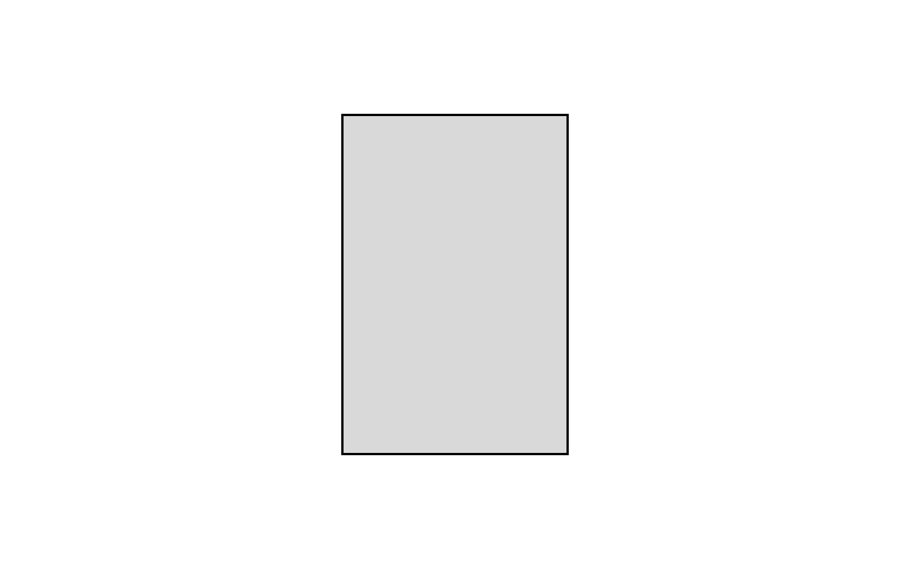
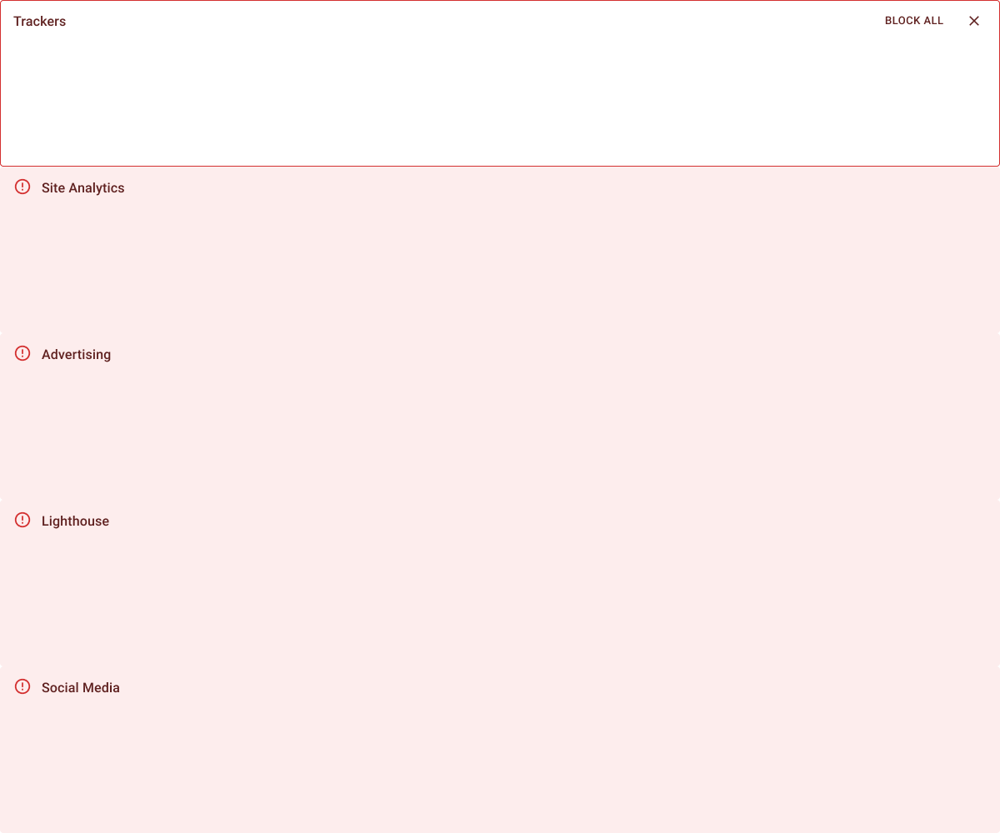
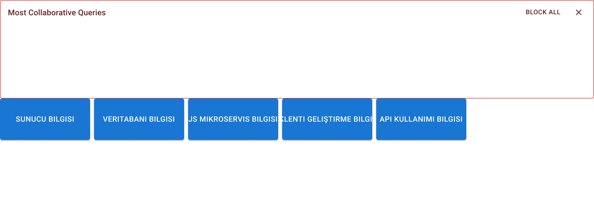
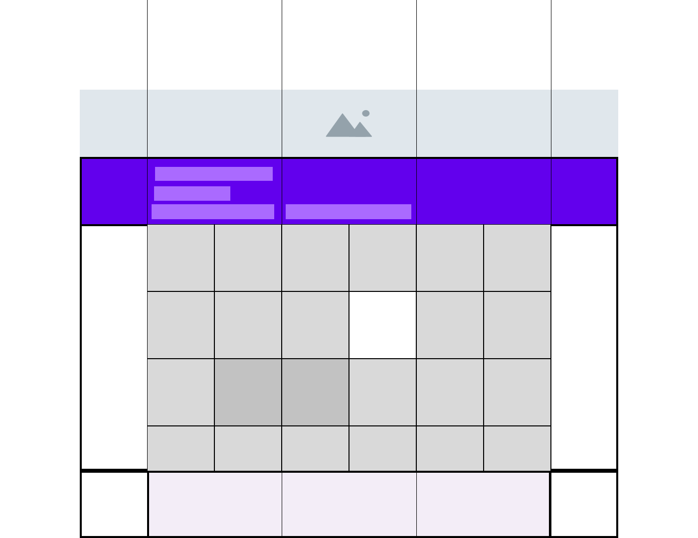
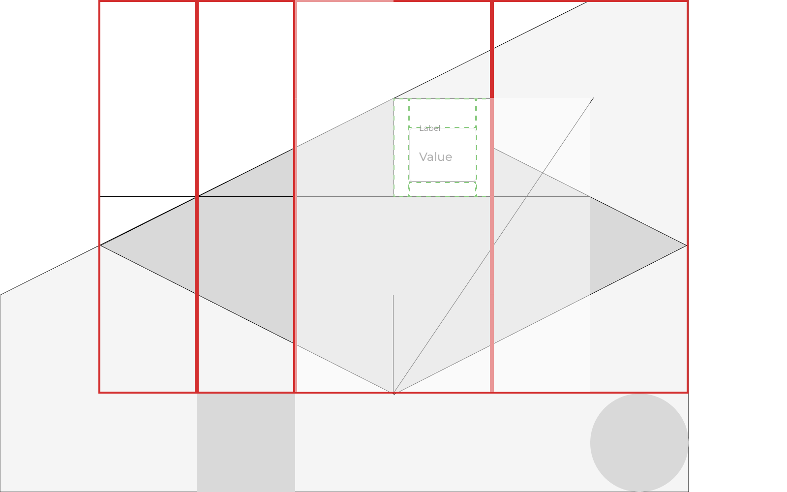

# Sayfa 1: Kullanıcı Giriş Modülü
[Sonraki Sayfa: Orta Seviye](#sayfa-2-orta-seviye)

# Sayfa 2: Bekleme Salonu
[Sonraki Sayfa: Orta Seviye](#sayfa-2-orta-seviye)

# Sayfa 3: Yarış Davetiyesi
[Sonraki Sayfa: Orta Seviye](#sayfa-2-orta-seviye)
Üretilen prototiplerde kelime ağacı örneği oyun grafikleridir

# Sayfa 4: En basit şekilde üstlü çizilen plan çizgileri (ön+arka) "Vakit" hakkında bilgi veren referans çizgileri olarak kabul edilecektir
[Sonraki Bölüm: Detaylar](#bölüm-1-giriş)
[Sonraki Bölüm: Detaylar](#bölüm-2-detaylar)

## Bölüm 1: Seneler sonra yeni bir proje başlatılacağı zaman  "Gerçek zamanlı depolama" hakkında araştırma yapılır

## Bölüm 2: Kazanılan para hakkında iyi yerlerde kullanılır

Her sayfayı bir başlıkla belirleyip, sayfanın alt kısmında **sonraki sayfa** bağlantıları ekleyerek sayfalama işlevselliği sağlayabilirsiniz.

[Önceki Sayfa](sayfa1.md) | [Sonraki Sayfa](sayfa3.md)

[Anasayfa](https://github.com/megaconet/Gitbook-README-Book/)
