# Sayfa 1: Kullanıcı Giriş Modülü
[Sonraki Sayfa: Orta Seviye](#sayfa-2-orta-seviye)
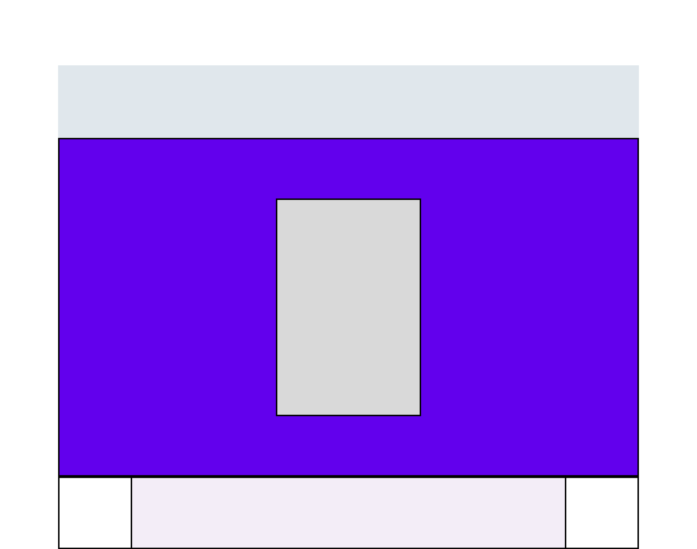

# Sayfa 2: Bekleme Salonu
[Sonraki Sayfa: Orta Seviye](#sayfa-2-orta-seviye)

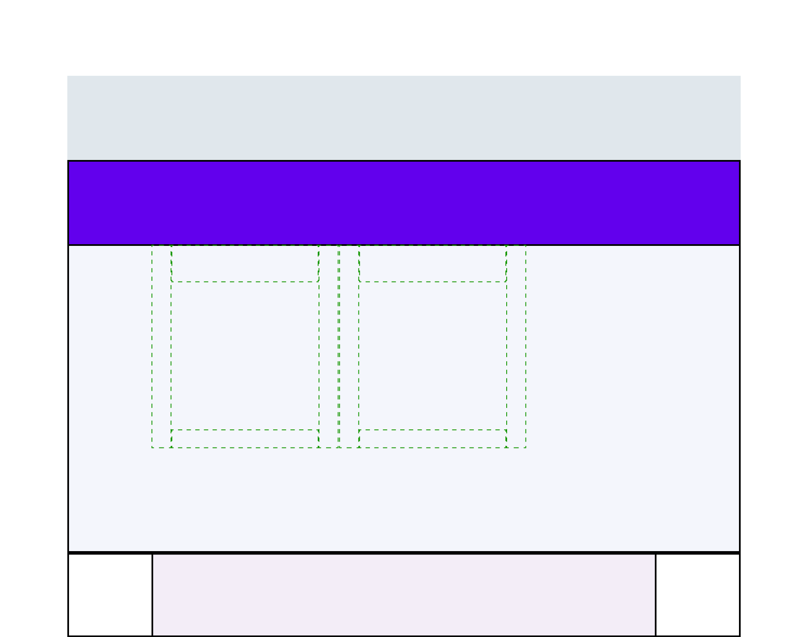

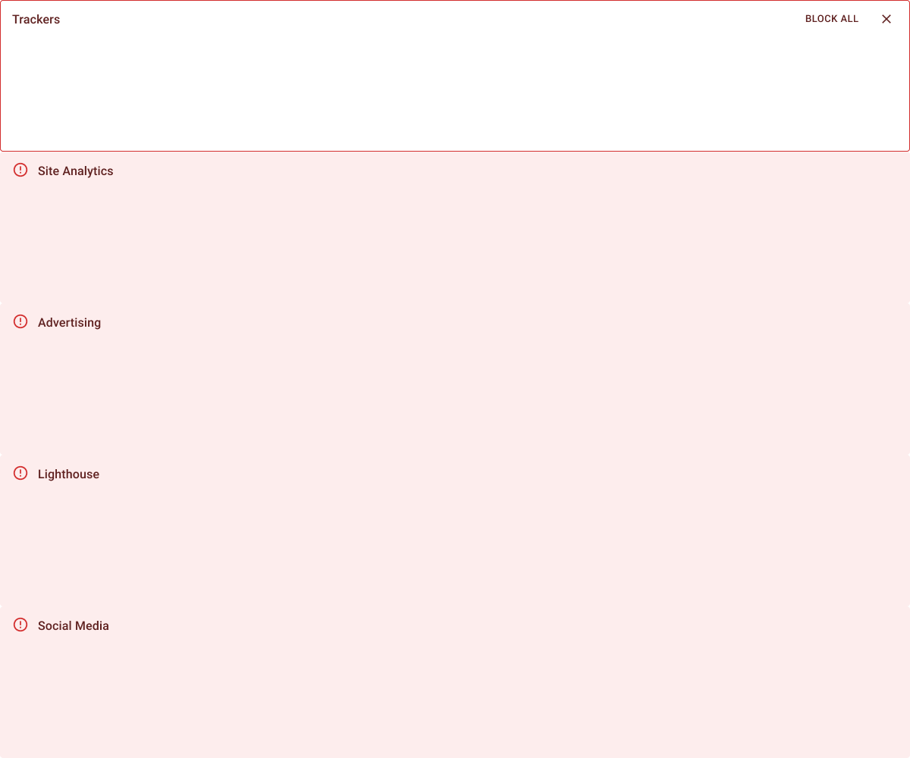

# Sayfa 3: ID-CHECK
[Sonraki Sayfa: Orta Seviye](#sayfa-2-orta-seviye)

# Sayfa 3: Yarış Davetiyesi
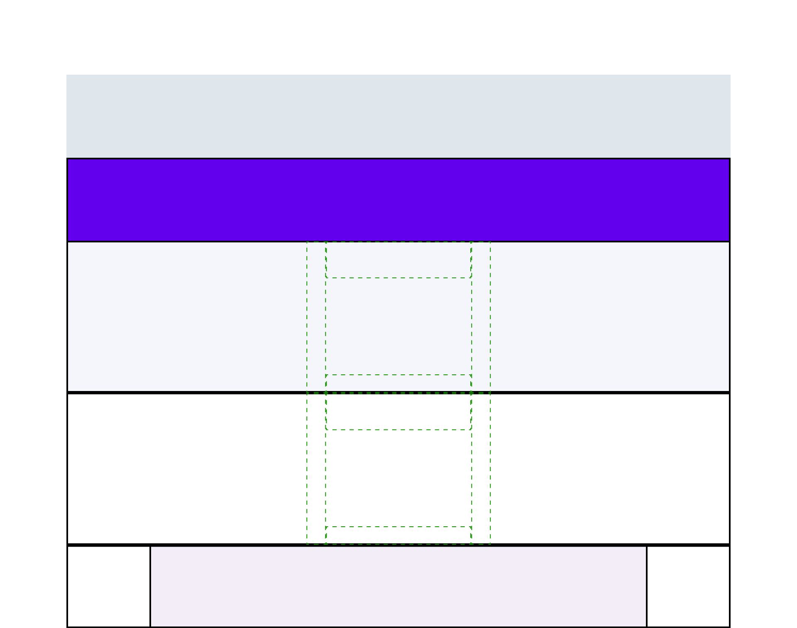
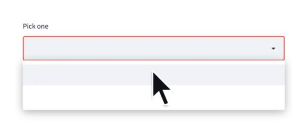
Üretilen prototiplerde kelime ağacı örneği oyun grafikleridir

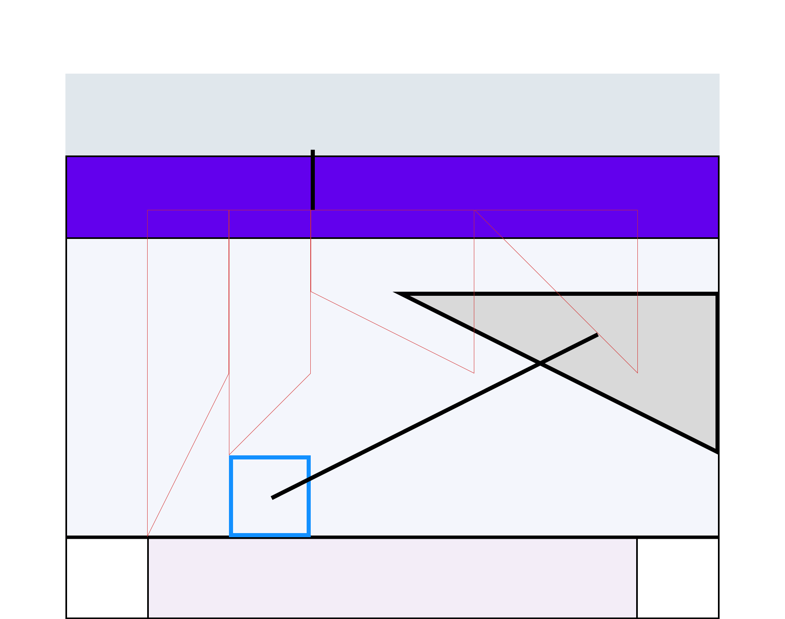

# Sayfa 4: Başlama vaktindeki yarış pozisyonu korunurken, tünel tamamlanınca dengeler bozulur
[Sonraki Bölüm: Detaylar](#bölüm-1-giriş)
[Sonraki Bölüm: Detaylar](#bölüm-2-detaylar)

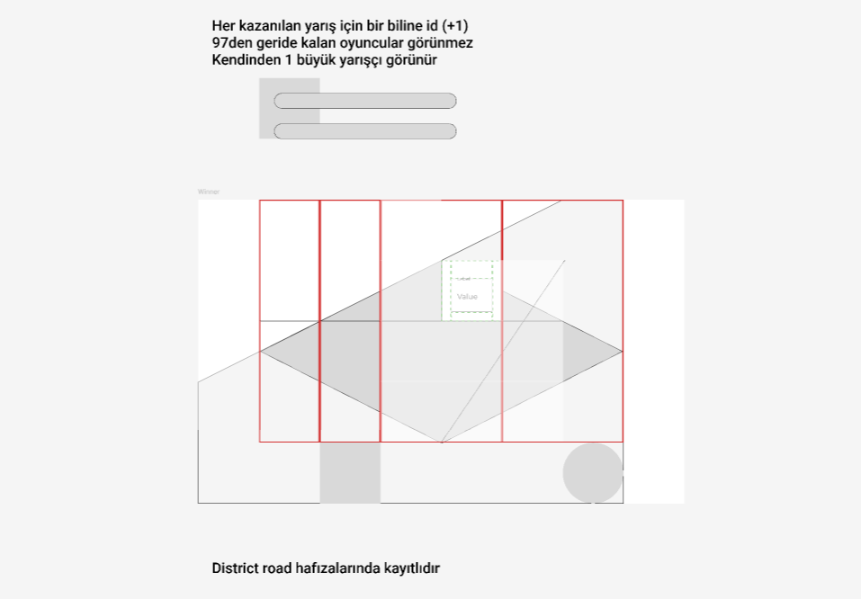
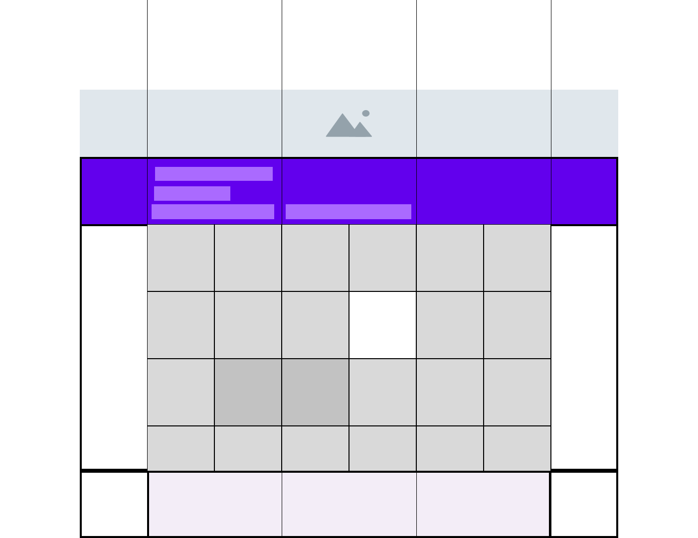

# Sayfa 5: Tünel hareketi 2kavis ile kazanan belli olur, 1ortalama ile finish anı yaşanır
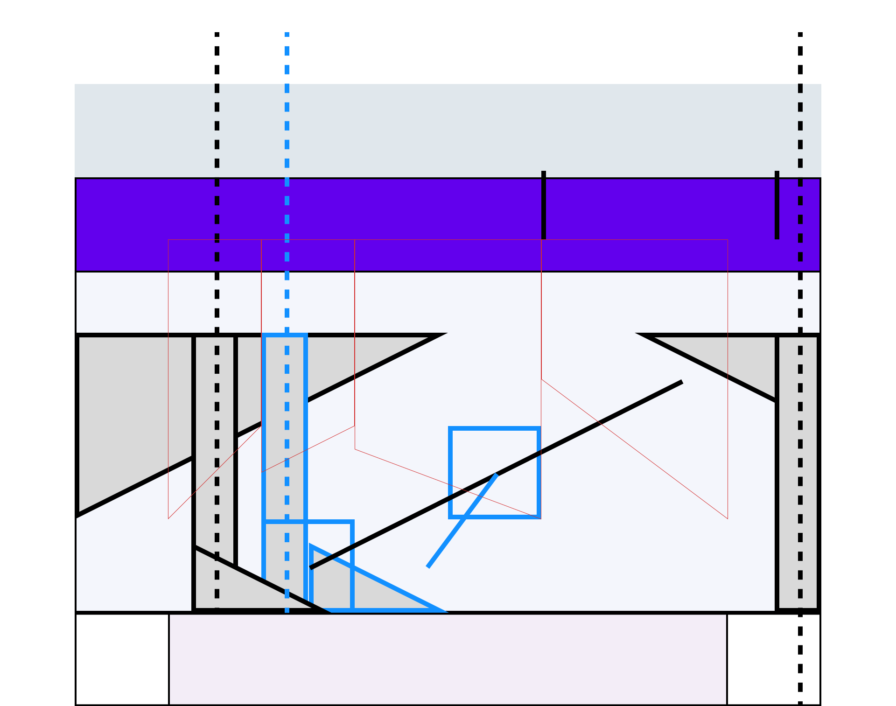

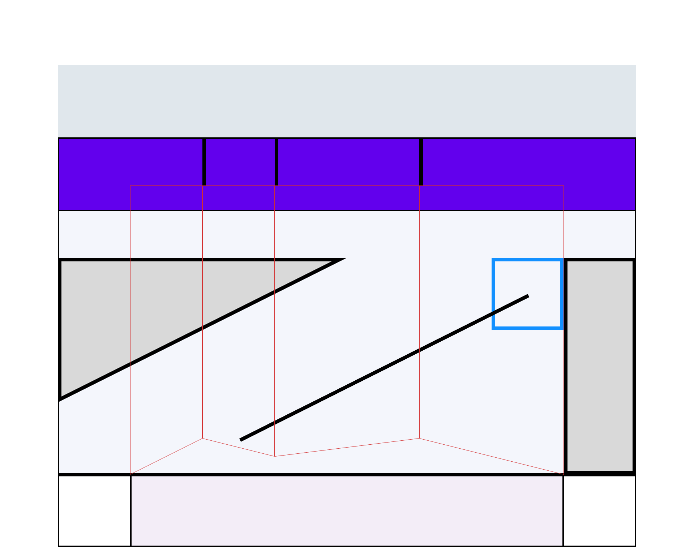

## Bölüm 1: Seneler sonra yeni bir proje başlatılacağı zaman  "Gerçek zamanlı depolama" hakkında araştırma yapılır

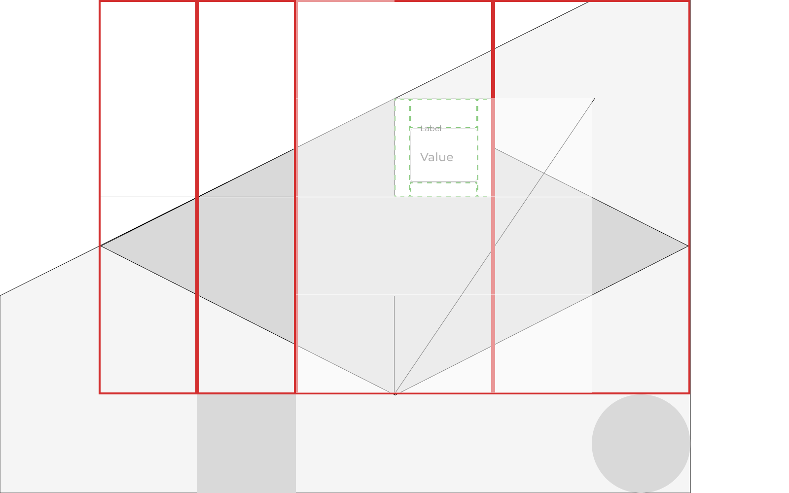

## Bölüm 2: 3D Unity yapılacak olanların tek sebebi kamera hareketleri ve tünel dikeyleşmesidir

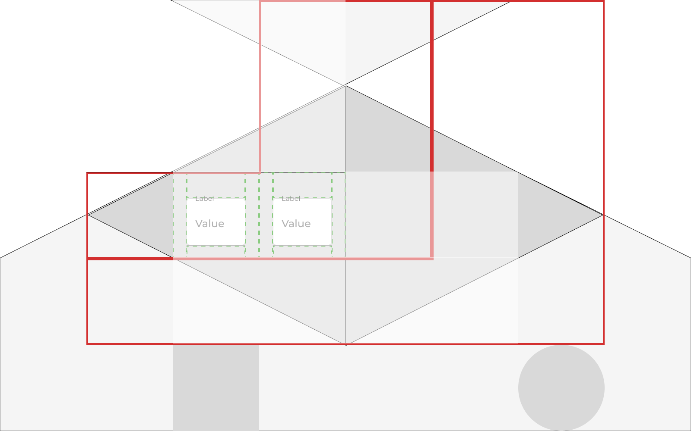
Her sayfayı bir başlıkla belirleyip, sayfanın alt kısmında **sonraki sayfa** bağlantıları ekleyerek sayfalama işlevselliği sağlayabilirsiniz.

[Önceki Sayfa](sayfa1.md) | [Sonraki Sayfa](sayfa3.md)

[Anasayfa](https://github.com/megaconet/Gitbook-README-Book/)
